# Smart MedScan

## 1. Giới thiệu dự án

**Smart MedScan** là ứng dụng Android hỗ trợ điều dưỡng trong việc quản lý hồ sơ bệnh nhân, lịch chăm sóc và nhận diện thuốc lâm sàng thông qua công nghệ OCR.

---

## 2. Mục tiêu đề tài

Đề tài: **Xây dựng ứng dụng di động hỗ trợ quản lý và nhận diện thuốc lâm sàng cho điều dưỡng**

Ứng dụng hướng đến việc hỗ trợ điều dưỡng:

- Quản lý thông tin bệnh nhân theo khoa, tầng và phòng.
- Quét và nhận diện tên thuốc từ vỏ hộp thuốc.
- Tra cứu thông tin thuốc từ cơ sở dữ liệu Firebase.
- Cảnh báo dị ứng thuốc dựa trên hồ sơ bệnh nhân.
- Tạo lịch chăm sóc và nhắc lịch bằng thông báo cục bộ.
- Quản lý thông tin cá nhân của điều dưỡng.

---
## 3. Video demo ứng dụng

Video demo trình bày các chức năng chính của Smart MedScan: đăng nhập, trang chủ, quản lý bệnh án, quét thuốc bằng OCR, lịch chăm sóc và trang cá nhân.

[▶ Xem video demo Smart MedScan]([https://drive.google.com/file/d/1abcxyz/view?usp=sharing](https://drive.google.com/file/d/1xdUXXbQHJhy0lVp_1v6qFLxzAkBYGtS0/view?usp=sharing))

## 4. Kết quả giao diện ứng dụng

### 4.1. Màn hình đăng ký tài khoản

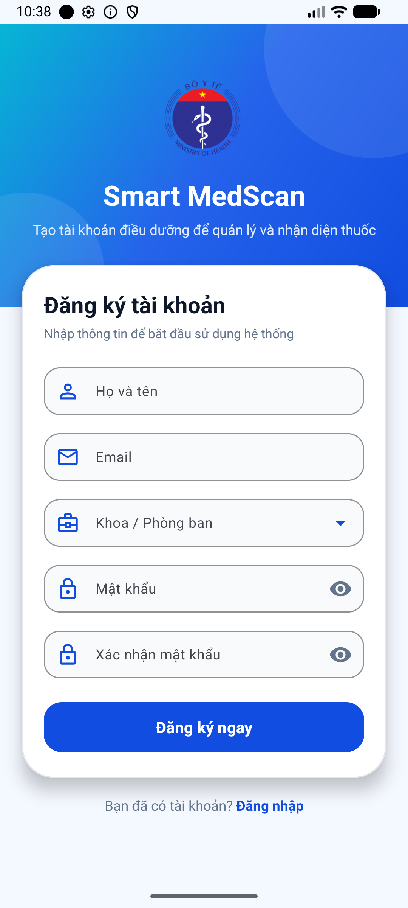

---

### 4.2. Màn hình đăng nhập

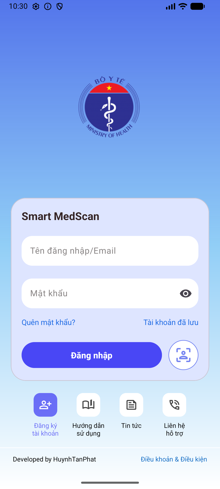

---

### 4.3. Màn hình trang chủ

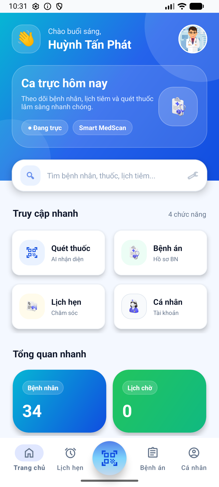

---

### 4.4. Màn hình lịch chăm sóc

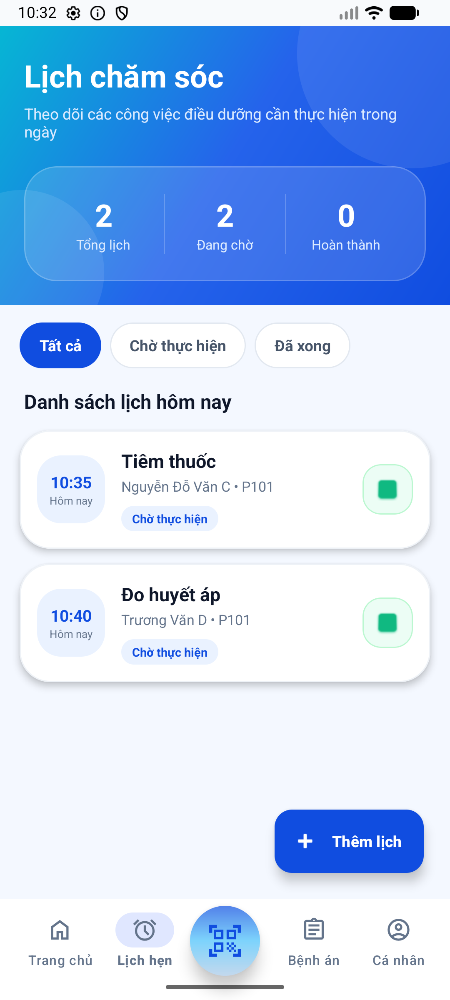

---

### 4.5. Màn hình thêm lịch hẹn

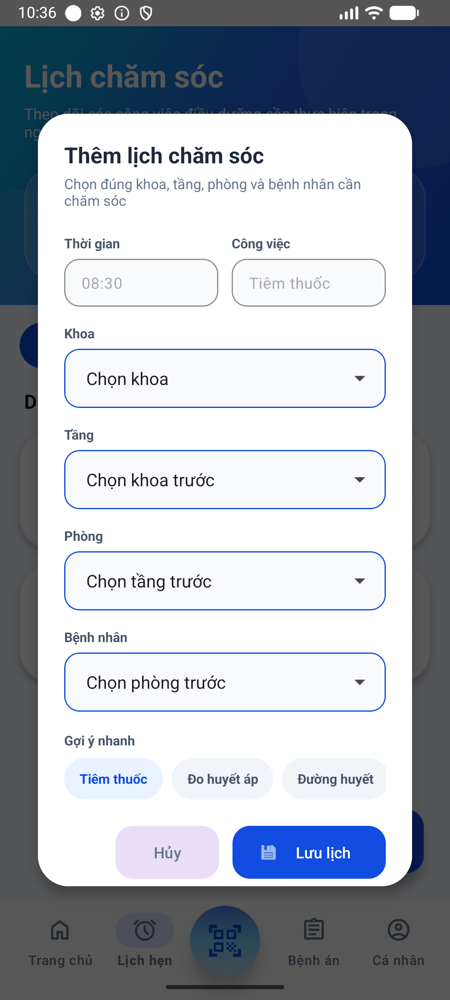

---

### 4.6. Màn hình quét thuốc

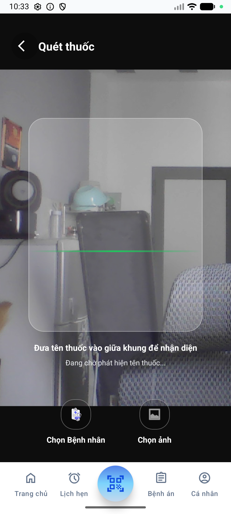

---

### 4.7. Màn hình chi tiết thuốc sau khi quét

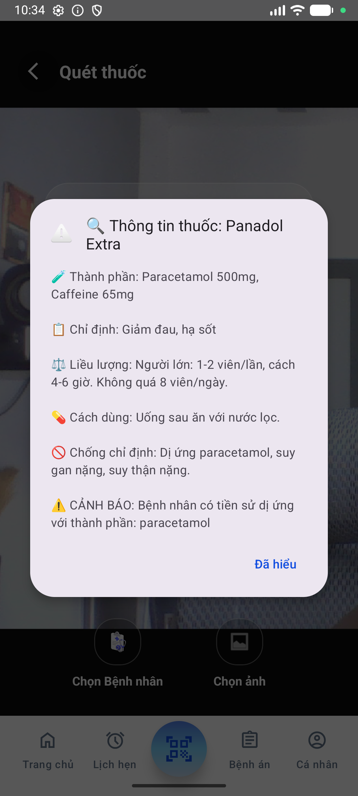

---

### 4.8. Màn hình quản lý khoa

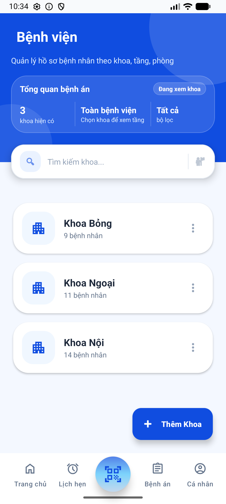

---

### 4.9. Màn hình quản lý tầng theo khoa

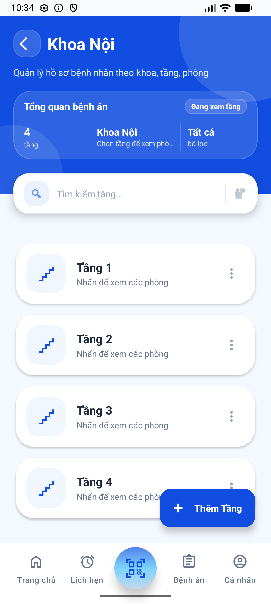

---

### 4.10. Màn hình quản lý phòng theo tầng

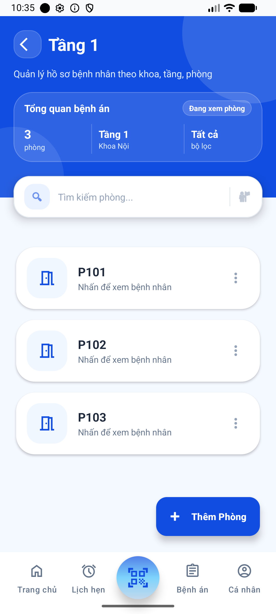

---

### 4.11. Màn hình danh sách bệnh nhân

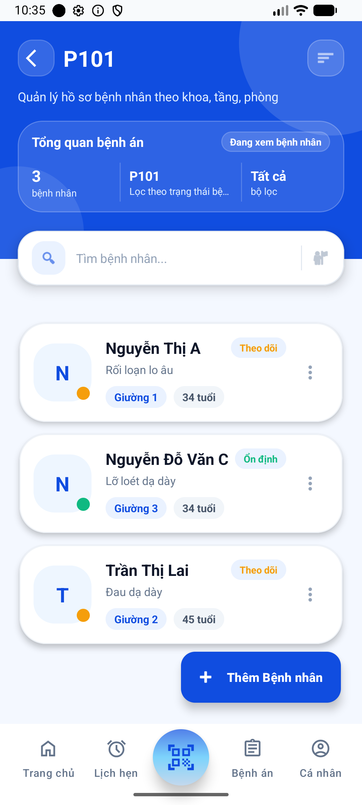

---

### 4.12. Màn hình thêm bệnh nhân

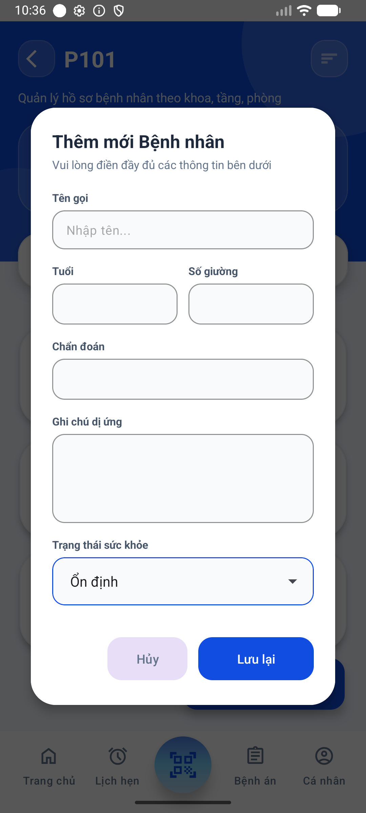

---

### 4.13. Màn hình thông tin bệnh nhân

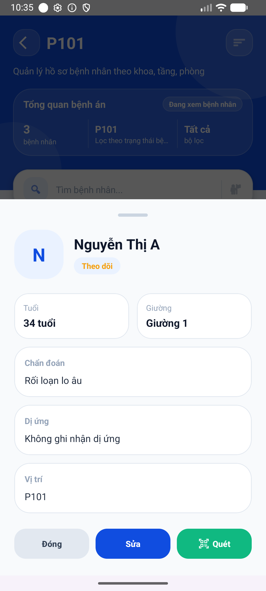

---

### 4.14. Màn hình cá nhân

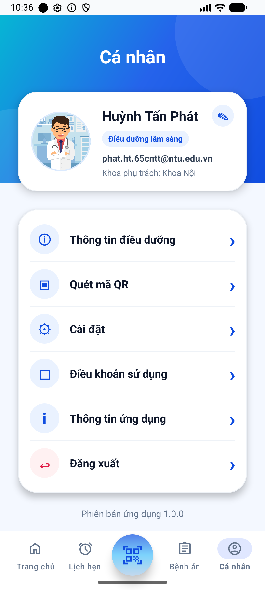

---

## 5. Tổng hợp giao diện chính

<table>
  <tr>
    <td align="center">
      <b>Đăng ký</b> 
      
    </td>
    <td align="center">
      <b>Đăng nhập</b> 
      
    </td>
    <td align="center">
      <b>Trang chủ</b> 
      
    </td>
  </tr>
  <tr>
    <td align="center">
      <b>Lịch chăm sóc</b> 
      
    </td>
    <td align="center">
      <b>Quét thuốc</b> 
      
    </td>
    <td align="center">
      <b>Cá nhân</b> 
      
    </td>
  </tr>
</table>
